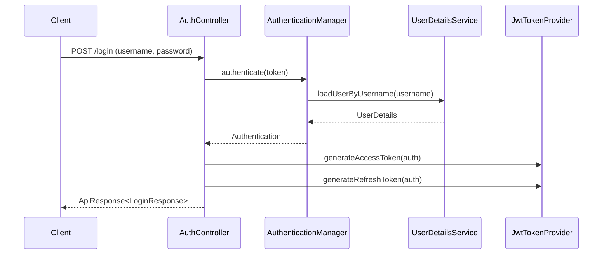

# Auth API

## 1. 로그인
- **URL**: `/api/v1/auth/login`
- **Method**: `POST`
- **Description**: 아이디(username)와 비밀번호로 로그인합니다. Access Token과 Refresh Token을 반환합니다.
- **Request Body**:
    ```json
    {
      "username": "user01",
      "password": "password"
    }
    ```
- **Response**: `ApiResponse<LoginResponse>`
  ```json
  {
    "accessToken": "eyJhbGci...",
    "refreshToken": "eyJhbGci..."
  }
  ```

### Login Flow


## 2. 로그아웃
- **URL**: `/api/v1/auth/logout`
- **Method**: `POST`
- **Authorization**: 인증 필요
- **Description**: Refresh Token을 무효화하고 세션을 종료합니다.
- **Response**: `ApiResponse<Void>`

## 3. 내 정보 조회
- **URL**: `/api/v1/auth/me`
- **Method**: `GET`
- **Authorization**: 인증 필요
- **Description**: 현재 로그인된 사용자의 정보를 조회합니다.
- **Response**: `ApiResponse<UserResponse>`

## 4. Access Token 재발급
- **URL**: `/api/v1/auth/refresh`
- **Method**: `POST`
- **Description**: Refresh Token을 사용해 새 Access Token을 발급받습니다. Refresh Token Rotation 적용.
- **Request Body**:
    ```json
    {
      "refreshToken": "eyJhbGci..."
    }
    ```
- **Response**: `ApiResponse<TokenResponse>`
  ```json
  {
    "accessToken": "eyJhbGci...",
    "refreshToken": "eyJhbGci..."
  }
  ```
- **Error Response**:
  - `401 Unauthorized`: 만료되었거나 유효하지 않은 Refresh Token
