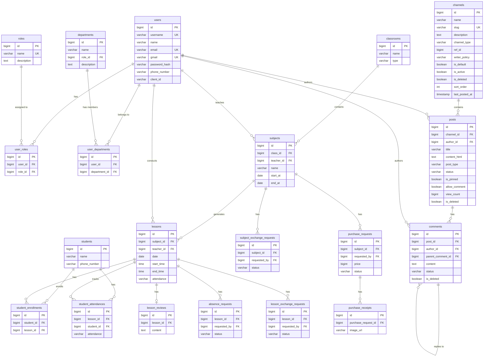

# 데이터 모델 설계 명세서

## 1. 개요

### 1.1 목적
- 프로젝트의 데이터 구조와 관계를 정의
- 데이터베이스 설계의 기초 자료 제공
- 개발팀 간 데이터 구조 공유 및 일관성 확보

### 1.2 범위
- 비즈니스 요구사항에 따른 엔티티 정의
- 엔티티 간 관계 설정
- 데이터 유형 및 제약조건 명시

### 1.3 참조 문서
- [PRD (Product Requirements Document)](../prd.md)
- [API 명세서](../02_api-spec/api_spec.md)
- [기술 명세서](../tech_spec.md)

## 2. 데이터 모델 아키텍처

### 2.1 엔티티 관계 요약

#### 1:N 관계

| 부모 엔티티 | 자식 엔티티 | FK 필드 | 설명 |
|-------------|-------------|---------|------|
| Users | User Roles | user_id | 사용자별 역할 |
| Departments | User Departments | department_id | 부서별 소속 사용자 |
| Classrooms | Subjects | class_id | 분반별 과목 |
| Subjects | Lessons | subject_id | 과목별 수업 |
| Users | Subjects | teacher_id | 봉사자가 담당하는 과목 |
| Users | Lessons | teacher_id | 봉사자가 진행하는 수업 |
| Lessons | Student Attendances | lesson_id | 수업별 학생 출석 |
| Lessons | Lesson Reviews | lesson_id | 수업별 수업 일지 |
| Lessons | Absence Requests | lesson_id | 수업별 결석 요청 |
| Lessons | Lesson Exchange Requests | lesson_id | 수업별 교환 요청 |
| Subjects | Subject Exchange Requests | subject_id | 과목별 교환 요청 |
| Subjects | Purchase Requests | subject_id | 과목별 기자재 구입 요청 |
| Purchase Requests | Purchase Receipts | purchase_request_id | 구입 요청별 영수증 |
| Users | 각종 요청들 | requested_by | 요청자 |
| Users | 각종 요청들 | approval_by | 승인자 |
| Students | Student Attendances | student_id | 학생별 출석 기록 |
| Channels | Posts | channel_id | 채널별 게시글 |
| Users | Posts | author_id | 게시글 작성자 |
| Posts | Comments | post_id | 게시글별 댓글 |
| Comments | Comments | parent_comment_id | 댓글 답글 (셀프 참조) |
| Users | Comments | author_id | 댓글 작성자 |

#### N:M 관계

| 엔티티 A | 엔티티 B | 조인 테이블 | 설명 |
|----------|----------|-------------|------|
| Users | Roles | user_roles | 사용자별 역할 부여 |
| Users | Departments | user_departments | 사용자별 담당 부서 |
| Students | Lessons | student_enrollments | 학생 수업 등록 |

### 2.2 ERD 다이어그램

## 3. 엔티티 정의

### 3.1 사용자 (Users)

손모음 플랫폼 서비스를 관리 혹은 이용하는 사용자입니다.

| 필드명 | 데이터 타입 | 제약조건 | 설명 |
|--------|-------------|----------|------|
| id | BIGINT | PRIMARY KEY, AUTO_INCREMENT | 사용자 고유 ID |
| username | VARCHAR(50) | UNIQUE, NOT NULL | 사용자 아이디 (로그인용) |
| name | VARCHAR(50) | NOT NULL | 사용자 실명 |
| email | VARCHAR(100) | UNIQUE, NULL | 이메일 주소 |
| gmail | VARCHAR(100) | UNIQUE, NULL | Gmail 주소 (OAuth) |
| password_hash | VARCHAR(512) | NULL | 암호화된 비밀번호 |
| phone_number | VARCHAR(20) | NULL | 전화번호 |
| client_id | VARCHAR(512) | NULL | OAuth Client ID |
| created_at | TIMESTAMP | NOT NULL, DEFAULT CURRENT_TIMESTAMP | 생성일시 |
| updated_at | TIMESTAMP | NOT NULL, DEFAULT CURRENT_TIMESTAMP ON UPDATE | 수정일시 |

### 3.2 역할 (Roles)

사용자의 역할을 정의하는 엔티티입니다. RoleType Enum으로 관리되며, 각 역할은 고유 ID를 가집니다.

**역할 계층 구조:**
- **기본 역할 (level 1-4)**: ADMIN(1), MANAGER(2), VOLUNTEER(3), GUEST(4) → `ROLE_` prefix 사용
- **부서 역할 (level 1001-1999)**: DEPT_FINANCE(1001), DEPT_ACADEMIC(1002), DEPT_IT(1003), DEPT_SUPPORT(1004) → prefix 없음
- **교육 역할 (level 2001-)**: TEACHER(2001) → prefix 없음

| 필드명 | 데이터 타입 | 제약조건 | 설명 |
|--------|-------------|----------|------|
| id | BIGINT | PRIMARY KEY | 역할 고유 ID (RoleType Enum에서 정의) |
| name | VARCHAR(50) | UNIQUE, NOT NULL | 역할 이름 (RoleType) |
| description | TEXT | NULL | 역할 설명 |

### 3.3 사용자 역할 조인 테이블 (user_roles)

사용자와 역할의 다대다 관계를 관리하는 조인 테이블입니다. 한 사용자는 여러 역할을 가질 수 있습니다.

| 필드명 | 데이터 타입 | 제약조건 | 설명 |
|--------|-------------|----------|------|
| id | BIGINT | PRIMARY KEY, AUTO_INCREMENT | 엔티티 고유 ID |
| user_id | BIGINT | FOREIGN KEY, NOT NULL | 사용자 ID |
| role_id | BIGINT | FOREIGN KEY, NOT NULL | 역할 ID (RoleType Enum ID) |
| created_at | TIMESTAMP | NOT NULL, DEFAULT CURRENT_TIMESTAMP | 생성일시 |
| updated_at | TIMESTAMP | NOT NULL, DEFAULT CURRENT_TIMESTAMP ON UPDATE | 수정일시 |

**제약조건:**
- UNIQUE (user_id, role_id): 동일한 사용자에게 동일한 역할이 중복 부여되지 않음

**Spring Security 권한 매핑:**
- 기본 역할 (ADMIN, MANAGER, VOLUNTEER, GUEST): `ROLE_` prefix 추가 (예: ROLE_ADMIN)
- 부서/교육 역할 (DEPT_*, TEACHER): prefix 없음 (예: DEPT_FINANCE, TEACHER)

### 3.4 부서 (departments)

조직 내 부서를 관리하는 엔티티입니다. 각 부서는 하나의 역할(RoleType)을 가질 수 있으며, 사용자가 부서에 참여/탈퇴할 때 해당 역할이 자동으로 부여/제거됩니다.

| 필드명 | 데이터 타입 | 제약조건 | 설명 |
|--------|-------------|----------|------|
| id | BIGINT | PRIMARY KEY, AUTO_INCREMENT | 엔티티 고유 ID |
| name | VARCHAR(50) | NOT NULL | 부서 이름 |
| description | TEXT | NULL | 추가 정보 |
| role_id | BIGINT | FOREIGN KEY, NULL | 부서에 할당된 역할 ID |
| created_at | TIMESTAMP | NOT NULL, DEFAULT CURRENT_TIMESTAMP | 생성일시 |
| updated_at | TIMESTAMP | NOT NULL, DEFAULT CURRENT_TIMESTAMP ON UPDATE | 수정일시 |

### 3.5 사용자-부서 조인 테이블 (user_departments)

사용자와 부서의 다대다 관계를 관리하는 조인 테이블입니다.

| 필드명 | 데이터 타입 | 제약조건 | 설명 |
|--------|-------------|----------|------|
| id | BIGINT | PRIMARY KEY, AUTO_INCREMENT | 엔티티 고유 ID |
| user_id | BIGINT | FOREIGN KEY, NOT NULL | 사용자 ID |
| department_id | BIGINT | FOREIGN KEY, NOT NULL | 부서 ID |
| created_at | TIMESTAMP | NOT NULL, DEFAULT CURRENT_TIMESTAMP | 생성일시 |
| updated_at | TIMESTAMP | NOT NULL, DEFAULT CURRENT_TIMESTAMP ON UPDATE | 수정일시 |

**제약조건:**
- UNIQUE (user_id, department_id): 동일한 사용자가 동일한 부서에 중복 참여 불가

### 3.6 분반(classrooms)

분반을 관리하는 엔티티입니다. 관리자가 추가 및 수정을 관리합니다.

| 필드명 | 데이터 타입 | 제약조건 | 설명 |
|--------|-------------|----------|------|
| id | BIGINT | PRIMARY KEY, AUTO_INCREMENT | 엔티티 고유 ID |
| name | VARCHAR(50) | NOT NULL | 분반 이름 |
| type | VARCHAR(20) | NOT NULL | 주중반, 주말반 등 |
| description | TEXT | NULL | 추가 정보 |
| created_at | TIMESTAMP | NOT NULL, DEFAULT CURRENT_TIMESTAMP | 생성일시 |
| updated_at | TIMESTAMP | NOT NULL, DEFAULT CURRENT_TIMESTAMP ON UPDATE | 수정일시 |

### 3.7 학생 (students)

학생을 관리하는 엔티티입니다. 현재로서는 관리자가 추가 및 등록을 관리합니다.

| 필드명 | 데이터 타입 | 제약조건 | 설명 |
|--------|-------------|----------|------|
| id | BIGINT | PRIMARY KEY, AUTO_INCREMENT | 엔티티 고유 ID |
| name | VARCHAR(50) | NOT NULL | 학생 이름 |
| phone_number | VARCHAR(20) | NULL | 학생 전화번호 |
| description | TEXT | NULL | 추가 정보 |
| created_at | TIMESTAMP | NOT NULL, DEFAULT CURRENT_TIMESTAMP | 생성일시 |
| updated_at | TIMESTAMP | NOT NULL, DEFAULT CURRENT_TIMESTAMP ON UPDATE | 수정일시 |

### 3.8 과목(subjects)

학생이 수업할 과목입니다. 학생과 봉사에 대한 협의 후 관리자가 추가 및 수정을 관리합니다.

| 필드명 | 데이터 타입 | 제약조건 | 설명 |
|--------|-------------|----------|------|
| id | BIGINT | PRIMARY KEY, AUTO_INCREMENT | 엔티티 고유 ID |
| class_id | BIGINT | FOREIGN KEY | 분반 ID |
| teacher_id | BIGINT | FOREIGN KEY | 선생님 ID |
| start_at | DATE | NOT NULL | 과목 시작일 |
| end_at | DATE | NOT NULL | 과목 종료일 |
| times | INT | NOT NULL | 과목 횟수 |
| day_of_week | VARCHAR(20) | NOT NULL | 요일 |
| start_time | TIME | NOT NULL | 시작 시간 |
| end_time | TIME | NOT NULL | 종료 시간 |
| period | INT | NOT NULL | 수업 시간 |
| name | VARCHAR(50) | NOT NULL | 과목 이름 |
| description | TEXT | NULL | 추가 정보 |
| created_at | TIMESTAMP | NOT NULL, DEFAULT CURRENT_TIMESTAMP | 생성일시 |
| updated_at | TIMESTAMP | NOT NULL, DEFAULT CURRENT_TIMESTAMP ON UPDATE | 수정일시 |

### 3.9 수업 (lessons)

수업을 관리하는 엔티티입니다. 봉사자가 관리자와 협의하여 수업을 생성할 때, 시작일, 요일, 횟수, 시간 등을 기반으로 자동 생성됩니다. 수업이 생성된 후에는 수업에 등록된 학생들에게 자동으로 수업 출석을 생성합니다.
이 수업은 캘린더 뷰 형태로 일별 / 월별로 조회할 수 있습니다.

| 필드명 | 데이터 타입 | 제약조건 | 설명 |
|--------|-------------|----------|------|
| id | BIGINT | PRIMARY KEY, AUTO_INCREMENT | 엔티티 고유 ID |
| subject_id | BIGINT | FOREIGN KEY | 과목 ID |
| teacher_id | BIGINT | FOREIGN KEY | 선생님 ID |
| date | DATE | NOT NULL | 수업 날짜 |
| start_time | TIME | NOT NULL | 수업 시작 시간 |
| end_time | TIME | NOT NULL | 수업 종료 시간 |
| attendance | VARCHAR(20) | NOT NULL | 교사(봉사자)의 출석 여부 |
| created_at | TIMESTAMP | NOT NULL, DEFAULT CURRENT_TIMESTAMP | 생성일시 |
| updated_at | TIMESTAMP | NOT NULL, DEFAULT CURRENT_TIMESTAMP ON UPDATE | 수정일시 |

### 3.10 학생 등록 (student_enrollments)

학생이 수업에 등록하는 엔티티입니다. 수업이 생성된 뒤 학생은 원하는 수업을 등록할 수 있습니다.

| 필드명 | 데이터 타입 | 제약조건 | 설명 |
|--------|-------------|----------|------|
| id | BIGINT | PRIMARY KEY, AUTO_INCREMENT | 엔티티 고유 ID |
| student_id | BIGINT | FOREIGN KEY | 학생 ID |
| lesson_id | BIGINT | FOREIGN KEY | 수업 ID |
| created_at | TIMESTAMP | NOT NULL, DEFAULT CURRENT_TIMESTAMP | 생성일시 |
| updated_at | TIMESTAMP | NOT NULL, DEFAULT CURRENT_TIMESTAMP ON UPDATE | 수정일시 |

### 3.11 학생 출석 (student_attendances)

학생의 출석을 관리하는 엔티티입니다. 수업이 생성된 뒤 등록된 학생에 대해 자동 생성되어 출석을 관리합니다.

| 필드명 | 데이터 타입 | 제약조건 | 설명 |
|--------|-------------|----------|------|
| id | BIGINT | PRIMARY KEY, AUTO_INCREMENT | 엔티티 고유 ID |
| lesson_id | BIGINT | FOREIGN KEY | 수업 ID |
| student_id | BIGINT | FOREIGN KEY | 학생 ID |
| attendance | VARCHAR(20) | NOT NULL | 학생의 출석 여부 |
| created_at | TIMESTAMP | NOT NULL, DEFAULT CURRENT_TIMESTAMP | 생성일시 |
| updated_at | TIMESTAMP | NOT NULL, DEFAULT CURRENT_TIMESTAMP ON UPDATE | 수정일시 |

### 3.12 수업 일지 (lesson_reviews)

수업 일지를 관리하는 엔티티입니다. 봉사자가 매 수업이 끝난 뒤 특이사항등을 기재한 수업 일지를 작성합니다.

| 필드명 | 데이터 타입 | 제약조건 | 설명 |
|--------|-------------|----------|------|
| id | BIGINT | PRIMARY KEY, AUTO_INCREMENT | 엔티티 고유 ID |
| lesson_id | BIGINT | FOREIGN KEY | 수업 ID |
| content | TEXT | NOT NULL | 수업 일지 내용 |
| created_at | TIMESTAMP | NOT NULL, DEFAULT CURRENT_TIMESTAMP | 생성일시 |
| updated_at | TIMESTAMP | NOT NULL, DEFAULT CURRENT_TIMESTAMP ON UPDATE | 수정일시 |

### 3.13 결석 요청 (absence_requests)

교사(봉사자)는 수업에 부득이하게 결석할 때 이를 요청하기 위해 사용하는 엔티티입니다.

| 필드명 | 데이터 타입 | 제약조건 | 설명 |
|--------|-------------|----------|------|
| id | BIGINT | PRIMARY KEY, AUTO_INCREMENT | 엔티티 고유 ID |
| lesson_id | BIGINT | FOREIGN KEY | 수업 ID |
| requested_by | BIGINT | FOREIGN KEY | 결석 요청자 ID |
| reason | TEXT | NOT NULL | 결석 이유 |
| status | VARCHAR(20) | NOT NULL | 결석 요청 상태 |
| approval_at | TIMESTAMP | NULL | 결석 요청 승인일시 |
| approval_by | BIGINT | FOREIGN KEY | 결석 요청 승인자 ID |
| note | TEXT | NULL | 추가 정보(관리자가 기입) |
| created_at | TIMESTAMP | NOT NULL, DEFAULT CURRENT_TIMESTAMP | 생성일시 |
| updated_at | TIMESTAMP | NOT NULL, DEFAULT CURRENT_TIMESTAMP ON UPDATE | 수정일시 |

### 3.14 수업 교환 요청 (lesson_exchange_requests)

교사(봉사자)는 수업을 교환할 때 이를 요청하기 위해 사용하는 엔티티입니다.

| 필드명 | 데이터 타입 | 제약조건 | 설명 |
|--------|-------------|----------|------|
| id | BIGINT | PRIMARY KEY, AUTO_INCREMENT | 엔티티 고유 ID |
| lesson_id | BIGINT | FOREIGN KEY | 수업 ID |
| requested_by | BIGINT | FOREIGN KEY | 수업 교환 요청자 ID |
| title | VARCHAR(255) | NOT NULL | 수업 교환 요청 제목 |
| content | TEXT | NOT NULL | 수업 교환 요청 내용 |
| status | VARCHAR(20) | NOT NULL | 수업 교환 요청 상태 |
| approval_at | TIMESTAMP | NULL | 수업 교환 요청 승인일시 |
| approval_by | BIGINT | FOREIGN KEY | 수업 교환 요청 승인자 ID |
| note | TEXT | NULL | 추가 정보(관리자가 기입) |
| created_at | TIMESTAMP | NOT NULL, DEFAULT CURRENT_TIMESTAMP | 생성일시 |
| updated_at | TIMESTAMP | NOT NULL, DEFAULT CURRENT_TIMESTAMP ON UPDATE | 수정일시 |

### 3.15 과목 교환 요청 (subject_exchange_requests)

교사(봉사자)가 과목을 교환할 때 이를 요청하기 위해 사용하는 엔티티입니다. 과목 교환 시에는
해당 일자 이후의 수업이 모두 교환되어야 합니다.

| 필드명 | 데이터 타입 | 제약조건 | 설명 |
|--------|-------------|----------|------|
| id | BIGINT | PRIMARY KEY, AUTO_INCREMENT | 엔티티 고유 ID |
| subject_id | BIGINT | FOREIGN KEY | 과목 ID |
| requested_by | BIGINT | FOREIGN KEY | 과목 교환 요청자 ID |
| title | VARCHAR(255) | NOT NULL | 과목 교환 요청 제목 |
| content | TEXT | NOT NULL | 과목 교환 요청 내용 |
| status | VARCHAR(20) | NOT NULL | 과목 교환 요청 상태 |
| approval_at | TIMESTAMP | NULL | 과목 교환 요청 승인일시 |
| approval_by | BIGINT | FOREIGN KEY | 과목 교환 요청 승인자 ID |
| note | TEXT | NULL | 추가 정보(관리자가 기입) |
| created_at | TIMESTAMP | NOT NULL, DEFAULT CURRENT_TIMESTAMP | 생성일시 |
| updated_at | TIMESTAMP | NOT NULL, DEFAULT CURRENT_TIMESTAMP ON UPDATE | 수정일시 |

### 3.16 기자재 구입 요청 (purchase_requests)

봉사자 혹은 관리자가 수업에 필요한 기자재를 구입하기 위해 사용하는 엔티티입니다.

| 필드명 | 데이터 타입 | 제약조건 | 설명 |
|--------|-------------|----------|------|
| id | BIGINT | PRIMARY KEY, AUTO_INCREMENT | 엔티티 고유 ID |
| subject_id | BIGINT | FOREIGN KEY | 과목 ID |
| requested_by | BIGINT | FOREIGN KEY | 기자재 구입 요청자 ID |
| title | VARCHAR(255) | NOT NULL | 기자재 구입 요청 제목 |
| content | TEXT | NOT NULL | 기자재 구입 요청 내용 |
| price | BIGINT | NOT NULL | 기자재 구입 요청 가격 |
| status | VARCHAR(20) | NOT NULL | 기자재 구입 요청 상태 |
| approval_at | TIMESTAMP | NULL | 기자재 구입 요청 승인일시 |
| approval_by | BIGINT | FOREIGN KEY | 기자재 구입 요청 승인자 ID |
| note | TEXT | NULL | 추가 정보(관리자가 기입) |
| created_at | TIMESTAMP | NOT NULL, DEFAULT CURRENT_TIMESTAMP | 생성일시 |
| updated_at | TIMESTAMP | NOT NULL, DEFAULT CURRENT_TIMESTAMP ON UPDATE | 수정일시 |

### 3.17 기자재 영수증 (purchase_receipts)

봉사자 혹은 관리자가 수업에 필요한 기자재를 구입한 후 이를 영수증으로 기록하기 위해 사용하는 엔티티입니다. 물품 구입 후 영수증을 이미지로 첨부하여 기록합니다.

| 필드명 | 데이터 타입 | 제약조건 | 설명 |
|--------|-------------|----------|------|
| id | BIGINT | PRIMARY KEY, AUTO_INCREMENT | 엔티티 고유 ID |
| purchase_request_id | BIGINT | FOREIGN KEY | 기자재 구입 요청 ID |
| image_url | VARCHAR(255) | NOT NULL | 영수증 이미지 URL |
| created_at | TIMESTAMP | NOT NULL, DEFAULT CURRENT_TIMESTAMP | 생성일시 |
| updated_at | TIMESTAMP | NOT NULL, DEFAULT CURRENT_TIMESTAMP ON UPDATE | 수정일시 |

---

### 3.18 채널 (channels)

게시글이 소속되는 컨테이너 엔티티입니다. `channelType`으로 소속 범위를 구분하고,
`writerPolicy`로 해당 채널에 글을 쓸 수 있는 사용자 범위를 제어합니다.
관리자/매니저만 생성·수정·삭제할 수 있습니다.

**ChannelType 값:**
- `ALL` — 기관 전체 채널 (공지사항 등)
- `CLASSROOM` — 특정 분반 전용 채널 (`ref_id` = 분반 ID)
- `DEPARTMENT` — 특정 부서 전용 채널 (`ref_id` = 부서 ID)
- `CUSTOM` — 외부 연동용 사용자 정의 채널 (`ref_id` = 커스텀 참조 ID)

**ChannelWriterPolicy 값:**
- `ALL_AUTHENTICATED` — 인증된 모든 사용자
- `ADMIN_MANAGER_ONLY` — 관리자/매니저만
- `CLASSROOM_MANAGER_TEACHER_ONLY` — 해당 분반의 교사(봉사자)만
- `DEPARTMENT_MEMBER_OR_ADMIN` — 해당 부서 멤버 또는 관리자

| 필드명 | 데이터 타입 | 제약조건 | 설명 |
|--------|-------------|----------|------|
| id | BIGINT | PRIMARY KEY, AUTO_INCREMENT | 채널 고유 ID |
| name | VARCHAR(100) | NOT NULL | 사용자에게 노출되는 채널 이름 |
| slug | VARCHAR(100) | UNIQUE (미삭제 기준), NOT NULL | 프론트 라우팅·운영 식별용 슬러그 |
| description | TEXT | NULL | 채널 운영 목적 설명 |
| channel_type | VARCHAR(20) | NOT NULL | 채널 유형 (ALL/CLASSROOM/DEPARTMENT/CUSTOM) |
| ref_id | BIGINT | NULL | channelType에 따른 참조 ID (분반/부서/커스텀) |
| writer_policy | VARCHAR(50) | NOT NULL | 게시글 작성 권한 정책 |
| is_default | BOOLEAN | NOT NULL, DEFAULT false | 기본 채널 여부 |
| is_active | BOOLEAN | NOT NULL, DEFAULT true | 활성 여부 (false = 숨김) |
| is_deleted | BOOLEAN | NOT NULL, DEFAULT false | 소프트 삭제 여부 |
| sort_order | INT | NOT NULL, DEFAULT 0 | 채널 목록 노출 순서 (오름차순) |
| last_posted_at | TIMESTAMP | NULL | 마지막 게시글 등록/삭제 후 재계산 시각 |
| created_at | TIMESTAMP | NOT NULL, DEFAULT CURRENT_TIMESTAMP | 생성일시 |
| updated_at | TIMESTAMP | NOT NULL, DEFAULT CURRENT_TIMESTAMP ON UPDATE | 수정일시 |

---

### 3.19 게시글 (posts)

채널 하위에 작성되는 게시글 엔티티입니다. HTML 본문을 저장하며, 조회수·고정·댓글 허용 여부를
관리합니다. 소프트 삭제 방식을 사용합니다.

**PostType 값:** `NOTICE` (공지), `GENERAL` (일반), `EVENT` (행사)

**PostStatus 값:** `DRAFT` (임시저장), `PUBLISHED` (게시), `ARCHIVED` (보관)

| 필드명 | 데이터 타입 | 제약조건 | 설명 |
|--------|-------------|----------|------|
| id | BIGINT | PRIMARY KEY, AUTO_INCREMENT | 게시글 고유 ID |
| channel_id | BIGINT | FOREIGN KEY, NOT NULL | 소속 채널 ID |
| author_id | BIGINT | FOREIGN KEY, NOT NULL | 작성자 사용자 ID |
| title | VARCHAR(255) | NOT NULL | 게시글 제목 |
| content_html | TEXT | NOT NULL | 게시글 본문 (HTML) |
| post_type | VARCHAR(20) | NOT NULL | 게시글 유형 (NOTICE/GENERAL/EVENT) |
| status | VARCHAR(20) | NOT NULL, DEFAULT 'PUBLISHED' | 게시 상태 |
| is_pinned | BOOLEAN | NOT NULL, DEFAULT false | 상단 고정 여부 |
| allow_comment | BOOLEAN | NOT NULL, DEFAULT false | 댓글 허용 여부 |
| view_count | BIGINT | NOT NULL, DEFAULT 0 | 누적 조회수 (상세 조회 시 +1) |
| is_deleted | BOOLEAN | NOT NULL, DEFAULT false | 소프트 삭제 여부 |
| created_at | TIMESTAMP | NOT NULL, DEFAULT CURRENT_TIMESTAMP | 생성일시 |
| updated_at | TIMESTAMP | NOT NULL, DEFAULT CURRENT_TIMESTAMP ON UPDATE | 수정일시 |

**동작 특이사항:**
- 게시글 생성·수정·삭제 시 `PostChangedEvent`를 발행하여 채널의 `last_posted_at`을 갱신합니다.
- 목록 조회 시 `is_pinned=true` 게시글이 먼저 정렬되고, 그다음 최신순입니다.
- 작성자 본인 또는 관리자/매니저만 수정·삭제할 수 있습니다.

---

### 3.20 댓글 (comments)

게시글 하위에 작성되는 댓글 엔티티입니다. `parent_comment_id`를 통해 답글(대댓글) 구조를
지원합니다. 게시글의 `allow_comment=true`인 경우에만 생성 가능합니다.

**CommentStatus 값:** `ACTIVE` (활성), `HIDDEN` (숨김)

| 필드명 | 데이터 타입 | 제약조건 | 설명 |
|--------|-------------|----------|------|
| id | BIGINT | PRIMARY KEY, AUTO_INCREMENT | 댓글 고유 ID |
| post_id | BIGINT | FOREIGN KEY, NOT NULL | 소속 게시글 ID |
| author_id | BIGINT | FOREIGN KEY, NOT NULL | 댓글 작성자 사용자 ID |
| parent_comment_id | BIGINT | FOREIGN KEY, NULL | 부모 댓글 ID (null이면 최상위 댓글) |
| content | TEXT | NOT NULL | 댓글 본문 |
| status | VARCHAR(20) | NOT NULL, DEFAULT 'ACTIVE' | 댓글 상태 |
| is_deleted | BOOLEAN | NOT NULL, DEFAULT false | 소프트 삭제 여부 |
| created_at | TIMESTAMP | NOT NULL, DEFAULT CURRENT_TIMESTAMP | 생성일시 |
| updated_at | TIMESTAMP | NOT NULL, DEFAULT CURRENT_TIMESTAMP ON UPDATE | 수정일시 |

**동작 특이사항:**
- `parent_comment_id`가 없으면 일반 댓글, 있으면 해당 댓글의 답글입니다.
- 클라이언트에서 `parentCommentId` 유무로 일반 댓글과 답글을 구분하여 스레드 UI를 구성합니다.
- 작성자 본인 또는 관리자/매니저만 삭제할 수 있습니다.
